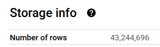

# Week 3 Homework

<b><u>Important Note:</b></u> <p>You can load the data however you would like, but keep the files in .GZ Format.
If you are using orchestration such as Airflow or Prefect do not load the data into Big Query using the orchestrator.</br>
Stop with loading the files into a bucket. </br></br>
<u>NOTE:</u> You can use the CSV option for the GZ files when creating an External Table</br>

<b>SETUP:</b></br>
Create an external table using the fhv 2019 data. </br>
Create a table in BQ using the fhv 2019 data (do not partition or cluster this table). </br>
Data can be found here: <https://github.com/DataTalksClub/nyc-tlc-data/releases/tag/fhv> </p>

## Question 1

**Question:**

>What is the count for fhv vehicle records for year 2019?

**Solution:**

```bash
# Download and upload to GCS the fhv 2019 data.
python etl_web_to_gsc.py
```

```sql
create or replace external table 
  `de-zoomcamp-375618.trips_data_all.ext_fhv_ny_taxi`
options (
  format = 'CSV',
  uris = ['gs://dtc_data_lake_de-zoomcamp-375618/data/fhv/fhv_tripdata_2019-*.csv.gz']
);

create or replace table 
  `de-zoomcamp-375618.trips_data_all.fhv_ny_taxi` as
select
  *
from
  `de-zoomcamp-375618.trips_data_all.ext_fhv_ny_taxi`;
```



**Files:**

[etl_web_to_gsc.py](etl_web_to_gsc.py)

**Answer:**

`43,244,696`

## Question 2

**Question:**

>Write a query to count the distinct number of affiliated_base_number for the entire dataset on both the tables.</br>
>What is the estimated amount of data that will be read when this query is executed on the External Table and the Table?

**Solution:**

```sql
select
  count(distinct Affiliated_base_number)
from
  `trips_data_all.ext_fhv_ny_taxi`;
```


```sql
select
  count(distinct Affiliated_base_number)
from
  `trips_data_all.fhv_ny_taxi`;
```


**Answer:**

`0 MB for the External Table and 317.94MB for the BQ Table`

## Question 3

**Question:**

>How many records have both a blank (null) PUlocationID and DOlocationID in the entire dataset?

**Solution:**

```sql
select
  count(*)
from
  `trips_data_all.fhv_ny_taxi`
where
  PUlocationID is null
  and DOlocationID is null;
```

**Answer:**

`717,748`

## Question 4

**Question:**

>What is the best strategy to optimize the table if query always filter by pickup_datetime and order by affiliated_base_number?

**Answer:**

`Partition by pickup_datetime Cluster on affiliated_base_number`

## Question 5

**Question:**

>Implement the optimized solution you chose for question 4. Write a query to retrieve the distinct affiliated_base_number between pickup_datetime 2019/03/01 and 2019/03/31 (inclusive).</br>
>Use the BQ table you created earlier in your from clause and note the estimated bytes. Now change the table in the from clause to the partitioned table you created for question 4 and note the estimated bytes processed. What are these values? Choose the answer which most closely matches.

**Solution:**

```sql
create or replace table 
  `de-zoomcamp-375618.trips_data_all.fhv_ny_taxi_partitioned` 
partition by
  date(pickup_datetime)
cluster by
  Affiliated_base_number as
select 
  * 
from
  `de-zoomcamp-375618.trips_data_all.ext_fhv_ny_taxi`;
```

```sql
select distinct
  Affiliated_base_number
from
  `trips_data_all.fhv_ny_taxi`
where
  date(pickup_datetime) between '2019-03-01' and '2019-03-31';
```


```sql
select distinct
  Affiliated_base_number
from
  `trips_data_all.fhv_ny_taxi_partitioned`
where
  date(pickup_datetime) between '2019-03-01' and '2019-03-31';
```


**Answer:**

`647.87 MB for non-partitioned table and 23.06 MB for the partitioned table`

## Question 6

**Question:**

>Where is the data stored in the External Table you created?

**Answer:**

`GCP Bucket`

## Question 7

**Question:**

>It is best practice in Big Query to always cluster your data:

**Answer:**

`False`

## (Not required) Question 8

**Question:**

>A better format to store these files may be parquet. Create a data pipeline to download the gzip files and convert them into parquet. Upload the files to your GCP Bucket and create an External and BQ Table.

>Note: Column types for all files used in an External Table must have the same datatype. While an External Table may be created and shown in the side panel in Big Query, this will need to be validated by running a count query on the External Table to check if any errors occur.

**Solution:**

```bash
# Download and upload to GCS the fhv 2019 data (with converting csv.gz to parquet).
python etl_web_to_gsc.py --to-parquet
```

```sql
create or replace external table
  `de-zoomcamp-375618.trips_data_all.ext_fhv_ny_taxi_pq`
options (
  format = 'parquet',
  uris =['gs://dtc_data_lake_de-zoomcamp-375618/data/fhv/fhv_tripdata_2019-*.parquet']
);

create or replace table 
  `de-zoomcamp-375618.trips_data_all.fhv_ny_taxi_pq` as
select
  *
from
  `de-zoomcamp-375618.trips_data_all.ext_fhv_ny_taxi_pq`;
```

**Files:**

[etl_web_to_gsc.py](etl_web_to_gsc.py)
