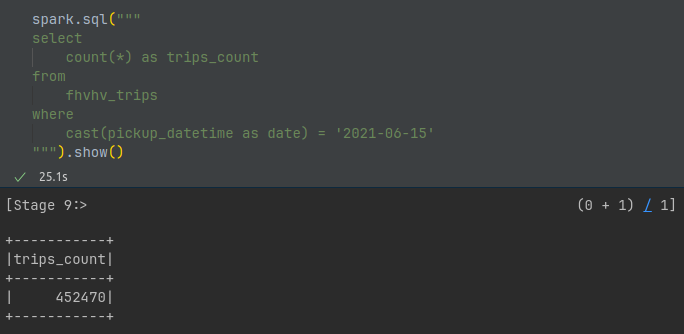
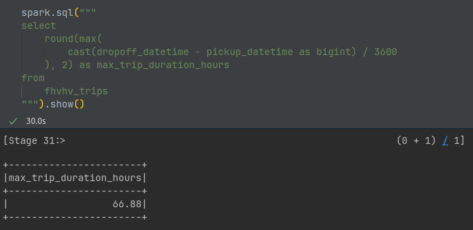
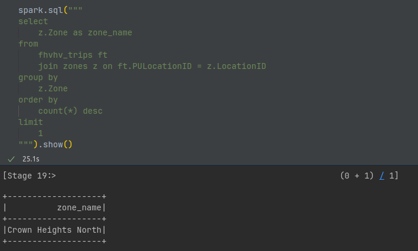

# Week 5 Homework

In this homework we'll put what we learned about Spark in practice.

For this homework we will be using the FHVHV 2021-06 data found here. [FHVHV Data](https://github.com/DataTalksClub/nyc-tlc-data/releases/download/fhvhv/fhvhv_tripdata_2021-06.csv.gz )

## Question 1

**Question:**

>**Install Spark and PySpark**
>
>- Install Spark
>- Run PySpark
>- Create a local spark session
>- Execute spark.version.
>
>What's the output?

**Solution:**

```bash
>>> spark.version
'3.3.2'
```

**Answer:**
`3.3.2`

## Question 2

**Question:**

>**HVFHW June 2021**
>
>Read it with Spark using the same schema as we did in the lessons.
>We will use this dataset for all the remaining questions.
>Repartition it to 12 partitions and save it to parquet.
>What is the average size of the Parquet (ending with .parquet extension) Files that were created (in MB)? Select the answer which most closely matches.

**Solution:**

```bash
ls -lh data/pq/fhvhv 

total 284M
-rw-r--r-- 1 aerik aerik   0 Mar  6 10:28 _SUCCESS
-rw-r--r-- 1 aerik aerik 24M Mar  6 10:28 part-00000-e58130b9-d990-45bb-b4c8-c54bc330c8f6-c000.snappy.parquet
-rw-r--r-- 1 aerik aerik 24M Mar  6 10:28 part-00001-e58130b9-d990-45bb-b4c8-c54bc330c8f6-c000.snappy.parquet
-rw-r--r-- 1 aerik aerik 24M Mar  6 10:28 part-00002-e58130b9-d990-45bb-b4c8-c54bc330c8f6-c000.snappy.parquet
-rw-r--r-- 1 aerik aerik 24M Mar  6 10:28 part-00003-e58130b9-d990-45bb-b4c8-c54bc330c8f6-c000.snappy.parquet
-rw-r--r-- 1 aerik aerik 24M Mar  6 10:28 part-00004-e58130b9-d990-45bb-b4c8-c54bc330c8f6-c000.snappy.parquet
-rw-r--r-- 1 aerik aerik 24M Mar  6 10:28 part-00005-e58130b9-d990-45bb-b4c8-c54bc330c8f6-c000.snappy.parquet
-rw-r--r-- 1 aerik aerik 24M Mar  6 10:28 part-00006-e58130b9-d990-45bb-b4c8-c54bc330c8f6-c000.snappy.parquet
-rw-r--r-- 1 aerik aerik 24M Mar  6 10:28 part-00007-e58130b9-d990-45bb-b4c8-c54bc330c8f6-c000.snappy.parquet
-rw-r--r-- 1 aerik aerik 24M Mar  6 10:28 part-00008-e58130b9-d990-45bb-b4c8-c54bc330c8f6-c000.snappy.parquet
-rw-r--r-- 1 aerik aerik 24M Mar  6 10:28 part-00009-e58130b9-d990-45bb-b4c8-c54bc330c8f6-c000.snappy.parquet
-rw-r--r-- 1 aerik aerik 24M Mar  6 10:28 part-00010-e58130b9-d990-45bb-b4c8-c54bc330c8f6-c000.snappy.parquet
-rw-r--r-- 1 aerik aerik 24M Mar  6 10:28 part-00011-e58130b9-d990-45bb-b4c8-c54bc330c8f6-c000.snappy.parquet
```

**Answer:**
`24MB`

## Question 3

**Question:**

>**Count records**
>
>How many taxi trips were there on June 15?
>Consider only trips that started on June 15.

**Solution:**



**Files:**

- [fhvhv_pyspark.ipynb](fhvhv_pyspark.ipynb)

**Answer:**

`452,470`

## Question 4

**Question:**

>**Longest trip for each day**
>
>Now calculate the duration for each trip.
>How long was the longest trip in Hours?

**Solution:**



**Files:**

- [fhvhv_pyspark.ipynb](fhvhv_pyspark.ipynb)

**Answer:**

`66.87 Hours`

## Question 5

**Question:**

>**User Interface**
>
>Spark’s User Interface which shows application's dashboard runs on which local port?

**Answer:**

`4040`

## Question 6

**Question:**

>**Most frequent pickup location zone**
>
>Load the zone lookup data into a temp view in Spark
>[Zone Data](https://github.com/DataTalksClub/nyc-tlc-data/releases/download/misc/taxi_zone_lookup.csv)
>
>Using the zone lookup data and the fhvhv June 2021 data, what is the name of the most frequent pickup location zone?

**Solution:**



**Files:**

- [fhvhv_pyspark.ipynb](fhvhv_pyspark.ipynb)

**Answer:**

`Crown Heights North`
